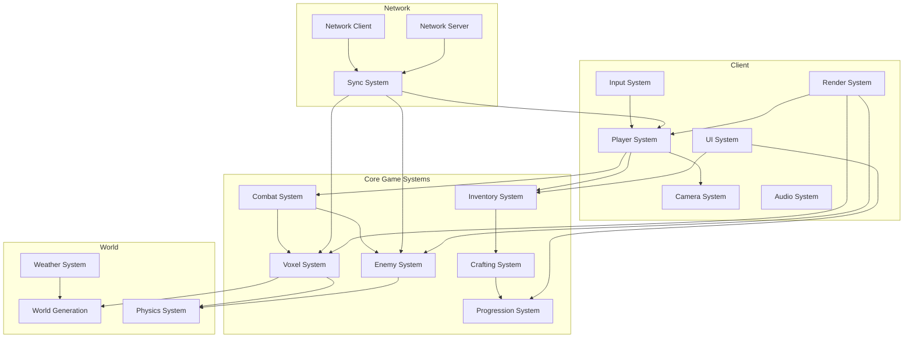
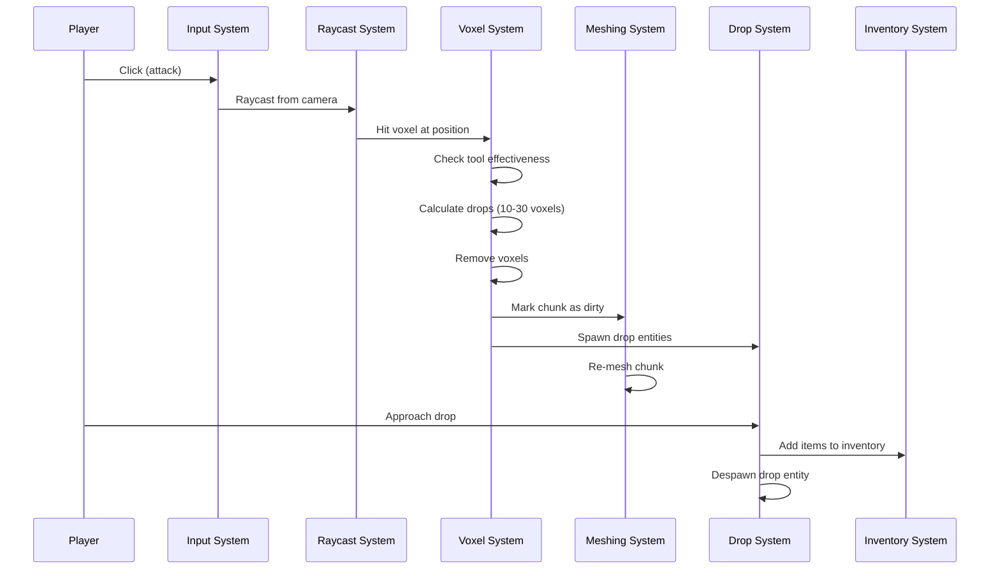
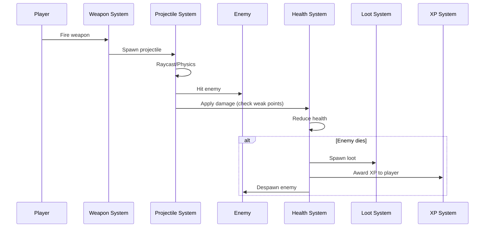
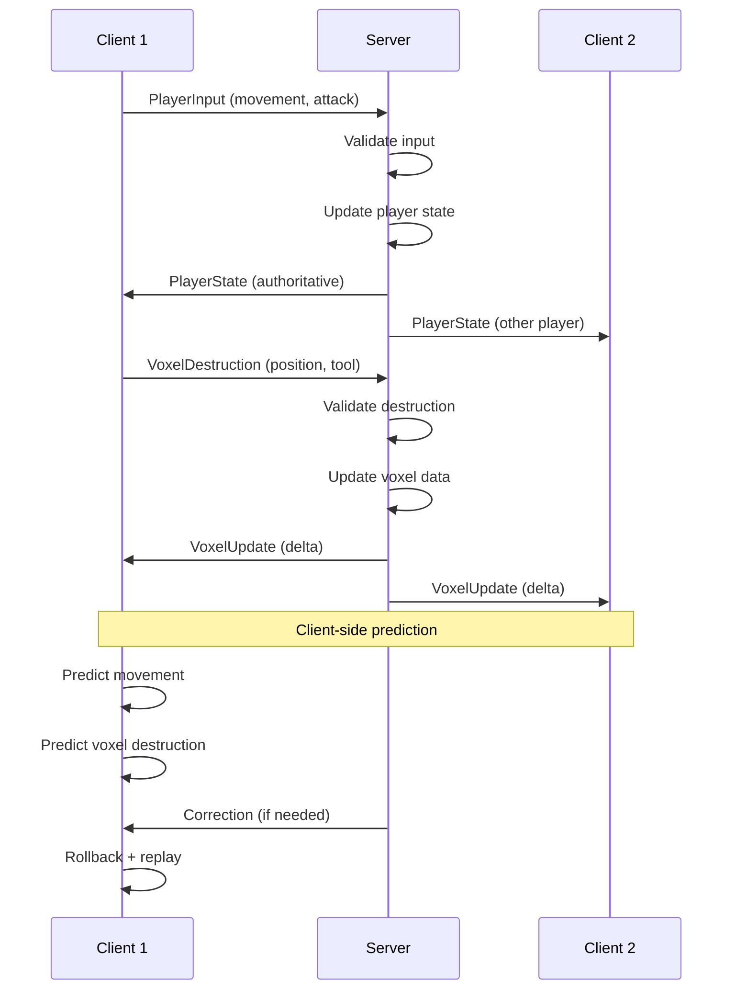

# Arquitectura Técnica - Voxel Extraction Shooter

## 🏗️ Visión General

Este documento describe la arquitectura técnica del juego, incluyendo sistemas ECS, flujo de datos, y decisiones técnicas clave.

---

## 📐 Arquitectura de Alto Nivel



---

## 🎮 Arquitectura ECS (Entity Component System)

### Entidades Principales

#### 1. Player Entity
```rust
#[derive(Component)]
struct Player {
    id: PlayerId,
}

#[derive(Component)]
struct Health {
    current: f32,
    max: f32,
}

#[derive(Component)]
struct Inventory {
    slots: [Option<ItemStack>; 256],
}

#[derive(Component)]
struct PlayerLevel {
    level: u32,
    xp: u32,
}

#[derive(Component)]
struct Equipment {
    weapon: Option<WeaponId>,
    tool: Option<ToolId>,
}
```

#### 2. Enemy Entity
```rust
#[derive(Component)]
struct Enemy {
    enemy_type: EnemyType,
}

#[derive(Component)]
struct Health {
    current: f32,
    max: f32,
}

#[derive(Component)]
struct AIState {
    state: AIStateEnum, // Idle, Chase, Attack, Flee
    target: Option<Entity>,
}

#[derive(Component)]
struct WeakPoints {
    points: Vec<WeakPoint>,
}
```

#### 3. Voxel Chunk Entity
```rust
#[derive(Component)]
struct VoxelChunk {
    position: IVec3, // Posición del chunk en grid
    voxels: [VoxelType; CHUNK_SIZE * CHUNK_SIZE * CHUNK_SIZE],
    dirty: bool, // Necesita re-meshing
}

#[derive(Component)]
struct ChunkMesh {
    vertices: Vec<Vertex>,
    indices: Vec<u32>,
}

#[derive(Component)]
struct ChunkCollider {
    collider_handle: ColliderHandle,
}
```

#### 4. Projectile Entity
```rust
#[derive(Component)]
struct Projectile {
    damage: f32,
    owner: Entity,
    weapon_type: WeaponType,
}

#[derive(Component)]
struct Velocity {
    linear: Vec3,
}
```

#### 5. Drop Entity
```rust
#[derive(Component)]
struct VoxelDrop {
    item_stack: ItemStack,
    lifetime: f32, // Despawn después de 60s
}
```

---

## 🔄 Flujo de Datos

### 1. Destrucción de Voxel



### 2. Combat con Enemigo



### 3. Sincronización Multiplayer



---

## 🗂️ Estructura de Datos

### Voxel Chunk Storage

```rust
// Opción 1: Array flat (más rápido)
pub struct VoxelChunk {
    voxels: [VoxelType; 32 * 32 * 32], // 32,768 voxels
}

impl VoxelChunk {
    fn get_voxel(&self, x: u32, y: u32, z: u32) -> VoxelType {
        let index = x + y * 32 + z * 32 * 32;
        self.voxels[index as usize]
    }
}

// Opción 2: Sparse storage (para chunks vacíos)
pub struct SparseVoxelChunk {
    default: VoxelType, // Air
    voxels: HashMap<IVec3, VoxelType>, // Solo voxels no-air
}
```

### Spatial Hashing para Entidades

```rust
pub struct SpatialHash {
    cell_size: f32, // 10m por celda
    cells: HashMap<IVec3, Vec<Entity>>,
}

impl SpatialHash {
    pub fn insert(&mut self, entity: Entity, position: Vec3) {
        let cell = self.get_cell(position);
        self.cells.entry(cell).or_default().push(entity);
    }
    
    pub fn query_radius(&self, position: Vec3, radius: f32) -> Vec<Entity> {
        // Retorna entidades en celdas cercanas
    }
}
```

### Inventory Storage

```rust
pub struct Inventory {
    slots: [Option<ItemStack>; 256],
}

#[derive(Clone)]
pub struct ItemStack {
    item_type: ItemType,
    count: u32,
    max_stack: u32,
}

pub enum ItemType {
    Voxel(VoxelType),
    Tool { tool_type: ToolType, durability: u32 },
    Weapon { weapon_type: WeaponType, ammo: u32 },
    Ammo(AmmoType),
}
```

---

## ⚡ Sistemas de Optimización

### 1. Chunk LOD (Level of Detail)

```rust
pub enum ChunkLOD {
    High,   // 0-50m: Full detail (32³ voxels)
    Medium, // 50-100m: Half detail (16³ voxels)
    Low,    // 100-200m: Quarter detail (8³ voxels)
    None,   // >200m: No render
}

fn update_chunk_lod(
    mut chunks: Query<(&Transform, &mut ChunkLOD)>,
    player: Query<&Transform, With<Player>>,
) {
    let player_pos = player.single().translation;
    
    for (chunk_transform, mut lod) in chunks.iter_mut() {
        let distance = chunk_transform.translation.distance(player_pos);
        
        *lod = match distance {
            d if d < 50.0 => ChunkLOD::High,
            d if d < 100.0 => ChunkLOD::Medium,
            d if d < 200.0 => ChunkLOD::Low,
            _ => ChunkLOD::None,
        };
    }
}
```

### 2. Frustum Culling

```rust
fn frustum_culling(
    mut chunks: Query<(&Transform, &mut Visibility), With<VoxelChunk>>,
    camera: Query<(&Camera, &GlobalTransform)>,
) {
    let (camera, camera_transform) = camera.single();
    let frustum = camera.frustum(camera_transform);
    
    for (chunk_transform, mut visibility) in chunks.iter_mut() {
        let chunk_aabb = compute_chunk_aabb(chunk_transform);
        
        if frustum.intersects_aabb(&chunk_aabb) {
            *visibility = Visibility::Visible;
        } else {
            *visibility = Visibility::Hidden;
        }
    }
}
```

### 3. Object Pooling

```rust
pub struct ProjectilePool {
    inactive: Vec<Entity>,
    active: HashSet<Entity>,
}

impl ProjectilePool {
    pub fn spawn(&mut self, commands: &mut Commands) -> Entity {
        if let Some(entity) = self.inactive.pop() {
            // Reutilizar entidad existente
            self.active.insert(entity);
            entity
        } else {
            // Crear nueva entidad
            let entity = commands.spawn(ProjectileBundle::default()).id();
            self.active.insert(entity);
            entity
        }
    }
    
    pub fn despawn(&mut self, entity: Entity) {
        self.active.remove(&entity);
        self.inactive.push(entity);
    }
}
```

### 4. Temporal Load Balancing

```rust
// Distribuir AI updates en múltiples frames
pub struct AIScheduler {
    enemies: Vec<Entity>,
    current_index: usize,
    enemies_per_frame: usize, // 50 enemigos por frame
}

fn update_ai_scheduled(
    mut scheduler: ResMut<AIScheduler>,
    mut enemies: Query<(&Transform, &mut AIState), With<Enemy>>,
) {
    let start = scheduler.current_index;
    let end = (start + scheduler.enemies_per_frame).min(scheduler.enemies.len());
    
    for i in start..end {
        let entity = scheduler.enemies[i];
        if let Ok((transform, mut ai_state)) = enemies.get_mut(entity) {
            update_single_ai(transform, &mut ai_state);
        }
    }
    
    scheduler.current_index = if end >= scheduler.enemies.len() {
        0 // Reiniciar
    } else {
        end
    };
}
```

---

## 🌐 Arquitectura de Red

### Client-Server Model

```
┌─────────────┐         ┌─────────────┐         ┌─────────────┐
│  Client 1   │         │   Server    │         │  Client 2   │
│             │         │             │         │             │
│ Prediction  │◄───────►│ Authority   │◄───────►│ Prediction  │
│ Rendering   │  Input  │ Simulation  │  State  │ Rendering   │
│ Audio       │  State  │ Validation  │  Input  │ Audio       │
└─────────────┘         └─────────────┘         └─────────────┘
```

### Network Messages

```rust
#[derive(Serialize, Deserialize)]
pub enum ClientMessage {
    PlayerInput {
        movement: Vec3,
        rotation: Quat,
        actions: PlayerActions, // Jump, shoot, etc.
    },
    VoxelDestruction {
        chunk_pos: IVec3,
        voxel_pos: IVec3,
        tool: ToolType,
    },
    ChatMessage(String),
}

#[derive(Serialize, Deserialize)]
pub enum ServerMessage {
    PlayerState {
        player_id: PlayerId,
        position: Vec3,
        rotation: Quat,
        health: f32,
    },
    EnemyState {
        enemy_id: EnemyId,
        position: Vec3,
        health: f32,
    },
    VoxelUpdate {
        chunk_pos: IVec3,
        changes: Vec<VoxelChange>, // Delta compression
    },
    SpawnEntity {
        entity_type: EntityType,
        position: Vec3,
    },
}

#[derive(Serialize, Deserialize)]
pub struct VoxelChange {
    local_pos: IVec3, // Posición dentro del chunk
    new_type: VoxelType,
}
```

### Interest Management

```rust
pub struct InterestManager {
    player_positions: HashMap<PlayerId, Vec3>,
    interest_radius: f32, // 100m
}

impl InterestManager {
    pub fn get_relevant_entities(&self, player_id: PlayerId) -> Vec<Entity> {
        let player_pos = self.player_positions[&player_id];
        
        // Solo sincronizar entidades dentro del radio
        self.entities
            .iter()
            .filter(|e| e.position.distance(player_pos) < self.interest_radius)
            .collect()
    }
}
```

---

## 🎯 Decisiones Técnicas Clave

### 1. ¿Por qué Bevy?
- **ECS nativo**: Perfecto para manejar 500+ entidades
- **Modular**: Fácil agregar/quitar features
- **Performance**: Rust + ECS = velocidad
- **Comunidad**: Crates para todo (rapier, lightyear, etc.)

### 2. ¿Por qué Surface Nets en lugar de Marching Cubes?
- **Más rápido**: ~2x más rápido que Marching Cubes
- **Menos vértices**: Meshes más ligeros
- **Terreno suave**: No blocky como Minecraft

### 3. ¿Por qué 32³ chunks?
- **Balance**: No muy grande (memoria), no muy pequeño (overhead)
- **Poder de 2**: Optimización de indexing
- **Estándar**: Usado en muchos voxel engines

### 4. ¿Por qué 256 slots de inventario?
- **Poder de 2**: Eficiente en memoria
- **Suficiente**: Para muchos items sin ser infinito
- **Balance**: No muy grande (UI compleja), no muy pequeño (frustración)

### 5. ¿Por qué servidor autoritativo?
- **Anti-cheat**: Servidor valida todo
- **Consistencia**: Todos ven lo mismo
- **Fuego amigo**: Necesita validación server-side

### 6. ¿Por qué agua estática?
- **Performance**: Agua dinámica es MUY costosa
- **Suficiente**: Para MVP, agua estática funciona
- **Futuro**: Puede agregarse después si es necesario

### 7. ¿Por qué colapso simplificado de edificios?
- **Performance**: Simular física de 1000+ voxels cayendo es costoso
- **Suficiente**: Desaparecer voxels se ve bien
- **Gameplay**: Más importante que realismo extremo

---

## 📊 Budgets de Rendimiento

### Frame Budget (60 FPS = 16.67ms)

| Sistema | Budget | Prioridad |
|---------|--------|-----------|
| Rendering | 8ms | Alta |
| Physics | 2ms | Alta |
| AI | 2ms | Media |
| Voxel Updates | 1ms | Media |
| Networking | 1ms | Alta |
| Audio | 0.5ms | Baja |
| UI | 0.5ms | Baja |
| Misc | 1.67ms | - |
| **Total** | **16.67ms** | - |

### Memory Budget

| Sistema | Budget | Notas |
|---------|--------|-------|
| Voxel Chunks | 100MB | ~200 chunks activos |
| Entities | 50MB | 500 enemigos + jugadores |
| Meshes | 100MB | Chunks + modelos |
| Textures | 200MB | Texturas de voxels + UI |
| Audio | 50MB | Música + SFX |
| **Total** | **500MB** | Target para PC medio |

### Network Budget

| Tipo | Budget | Frecuencia |
|------|--------|------------|
| Player State | 1KB | 60 Hz |
| Enemy State | 5KB | 20 Hz |
| Voxel Updates | 10KB | 10 Hz |
| Chat/Voice | Variable | - |
| **Total** | **~5MB/s** | Por jugador |

---

## 🔮 Futuras Optimizaciones

### GPU-Driven Rendering
- Culling en GPU
- Mesh shaders (si disponible)
- Compute shaders para voxel meshing

### Advanced Networking
- Snapshot interpolation
- Lag compensation
- Bandwidth prediction

### Advanced AI
- Machine learning para comportamiento
- Swarm intelligence
- Dynamic difficulty adjustment

### Procedural Generation
- Infinite world streaming
- Persistent world saves
- Multiplayer world sharing
