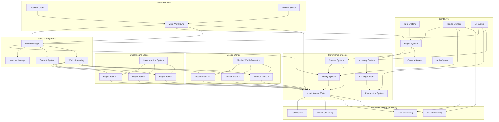
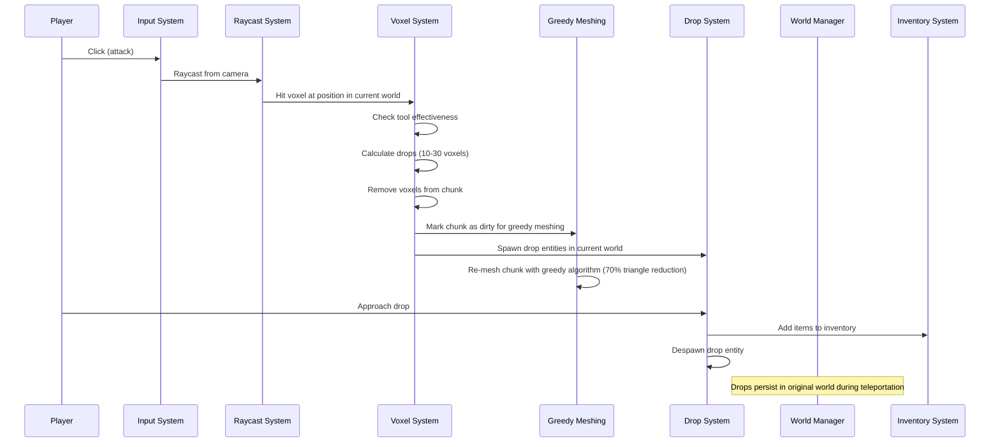
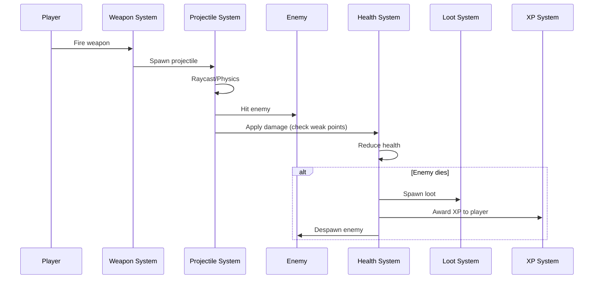
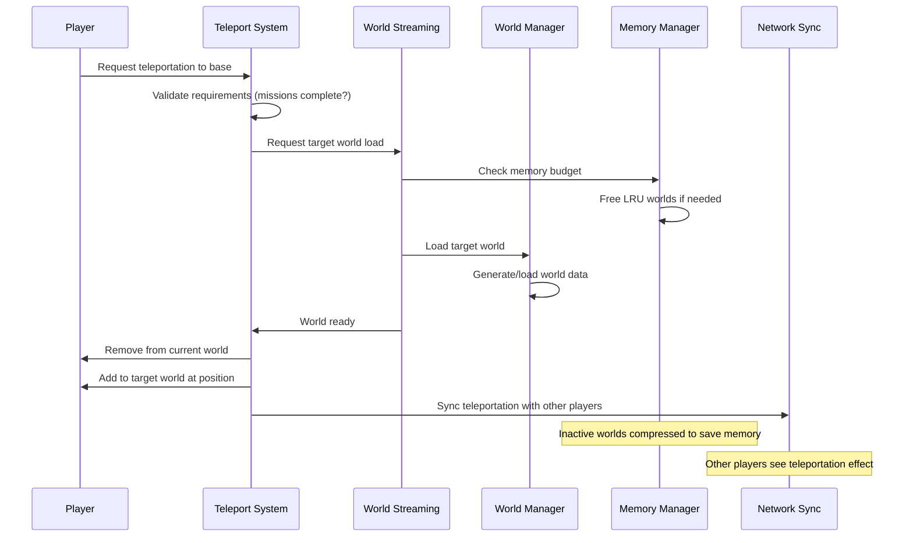
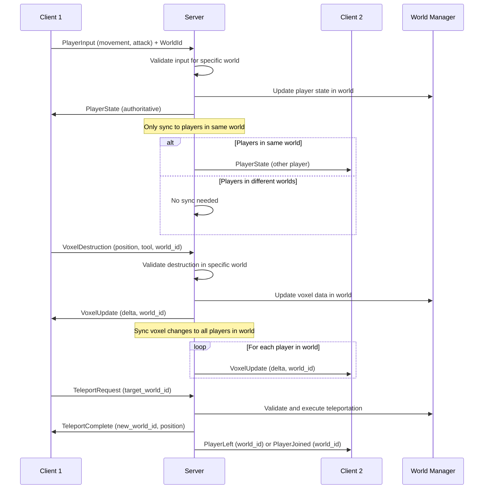

# Arquitectura Técnica - Voxel Extraction Shooter Multijugador

## 🏗️ Visión General

Este documento describe la arquitectura técnica del juego de extracción voxel multijugador, incluyendo sistemas ECS, flujo de datos, arquitectura de mundos múltiples, y decisiones técnicas clave para soportar mundos de misión procedurales, bases subterráneas persistentes, y edificios de hasta 20 pisos.

---

## 📐 Arquitectura de Alto Nivel



---

## 🎮 Arquitectura ECS (Entity Component System)

### Entidades Principales

#### 1. Player Entity
```rust
#[derive(Component)]
struct Player {
    id: PlayerId,
}

#[derive(Component)]
struct Health {
    current: f32,
    max: f32,
}

#[derive(Component)]
struct Inventory {
    slots: [Option<ItemStack>; 256],
}

#[derive(Component)]
struct PlayerLevel {
    level: u32,
    xp: u32,
}

#[derive(Component)]
struct Equipment {
    weapon: Option<WeaponId>,
    tool: Option<ToolId>,
}
```

#### 2. Enemy Entity
```rust
#[derive(Component)]
struct Enemy {
    enemy_type: EnemyType,
}

#[derive(Component)]
struct Health {
    current: f32,
    max: f32,
}

#[derive(Component)]
struct AIState {
    state: AIStateEnum, // Idle, Chase, Attack, Flee
    target: Option<Entity>,
}

#[derive(Component)]
struct WeakPoints {
    points: Vec<WeakPoint>,
}
```

#### 3. Voxel Chunk Entity (Updated for 2048 Height)
```rust
#[derive(Component)]
struct VoxelChunk {
    position: IVec3, // Posición del chunk en grid
    voxels: Box<[VoxelType; CHUNK_SIZE * WORLD_HEIGHT * CHUNK_SIZE]>, // Heap allocation
    dirty: bool, // Necesita re-meshing
    lod_level: ChunkLOD, // Level of detail para chunks distantes
    world_id: WorldId, // ID del mundo al que pertenece
}

#[derive(Component)]
struct ChunkMesh {
    vertices: Vec<Vertex>,
    indices: Vec<u32>,
    triangle_count: usize, // Para métricas de greedy meshing
}

#[derive(Component)]
struct ChunkCollider {
    collider_handle: ColliderHandle,
}

// Nuevo: LOD system para chunks verticales
pub enum ChunkLOD {
    Full,    // 0-100m: Full 2048 height
    Half,    // 100-200m: 1024 height
    Quarter, // 200-400m: 512 height
    Minimal, // 400m+: 256 height
}

// Nuevo: Identificación de mundos
#[derive(Clone, Copy, PartialEq, Eq, Hash)]
pub enum WorldId {
    MissionWorld(u64), // Seed-based ID
    UndergroundBase(PlayerId),
    Overworld,
}
```

#### 4. Projectile Entity
```rust
#[derive(Component)]
struct Projectile {
    damage: f32,
    owner: Entity,
    weapon_type: WeaponType,
}

#[derive(Component)]
struct Velocity {
    linear: Vec3,
}
```

#### 5. Drop Entity (Updated for Multi-World)
```rust
#[derive(Component)]
struct VoxelDrop {
    item_stack: ItemStack,
    lifetime: f32, // Despawn después de 60s
    world_id: WorldId, // Mundo donde existe el drop
    ground_position: Vec3, // Posición en el suelo (dual contouring compatible)
}
```

#### 6. World Entity (New)
```rust
#[derive(Component)]
struct World {
    world_id: WorldId,
    world_type: WorldType,
    loaded_chunks: HashSet<IVec3>,
    active_players: HashSet<PlayerId>,
    last_accessed: Instant,
    memory_usage: usize,
}

pub enum WorldType {
    MissionWorld {
        biome: BiomeType,
        missions: Vec<Mission>,
        extraction_point: Vec3,
        seed: u64,
    },
    UndergroundBase {
        owner: PlayerId,
        facilities: Vec<BaseFacility>,
        invasion_status: InvasionStatus,
    },
    Overworld {
        regions: HashMap<RegionId, OverworldRegion>,
    },
}

#[derive(Component)]
struct TeleportPoint {
    world_id: WorldId,
    position: Vec3,
    teleport_type: TeleportType,
    requirements: Vec<TeleportRequirement>,
}

pub enum TeleportType {
    MissionToBase,
    BaseToMission,
    Emergency, // Durante invasiones
    Overworld,
}
```

---

## 🔄 Flujo de Datos

### 1. Destrucción de Voxel Multi-Mundo



### 2. Combat con Enemigo



### 3. Teleportación Entre Mundos



### 4. Sincronización Multiplayer Multi-Mundo



---

## 🗂️ Estructura de Datos

### Voxel Chunk Storage (Updated for 2048 Height)

```rust
// Opción 1: Array flat con heap allocation (previene stack overflow)
pub struct VoxelChunk {
    voxels: Box<[VoxelType; CHUNK_SIZE * WORLD_HEIGHT * CHUNK_SIZE]>, // 128×2048×128 = ~33M voxels
    world_id: WorldId,
    lod_level: ChunkLOD,
}

impl VoxelChunk {
    fn get_voxel(&self, x: u32, y: u32, z: u32) -> VoxelType {
        let index = x + y * CHUNK_SIZE as u32 + z * CHUNK_SIZE as u32 * WORLD_HEIGHT as u32;
        self.voxels[index as usize]
    }
    
    // Nuevo: Crear chunk con LOD específico
    fn new_with_lod(world_id: WorldId, lod: ChunkLOD) -> Self {
        let effective_height = match lod {
            ChunkLOD::Full => WORLD_HEIGHT,
            ChunkLOD::Half => WORLD_HEIGHT / 2,
            ChunkLOD::Quarter => WORLD_HEIGHT / 4,
            ChunkLOD::Minimal => WORLD_HEIGHT / 8,
        };
        
        // Allocate on heap to prevent stack overflow
        let mut voxels = vec![VoxelType::Air; CHUNK_SIZE * effective_height * CHUNK_SIZE];
        let boxed_voxels = voxels.into_boxed_slice();
        
        Self {
            voxels: unsafe { 
                Box::from_raw(Box::into_raw(boxed_voxels) as *mut [VoxelType; CHUNK_SIZE * WORLD_HEIGHT * CHUNK_SIZE])
            },
            world_id,
            lod_level: lod,
        }
    }
}

// Opción 2: Sparse storage para chunks mayormente vacíos (bases subterráneas)
pub struct SparseVoxelChunk {
    default: VoxelType, // Air
    voxels: HashMap<IVec3, VoxelType>, // Solo voxels no-air
    world_id: WorldId,
}
```

### Spatial Hashing para Entidades Multi-Mundo

```rust
pub struct SpatialHash {
    cell_size: f32, // 10m por celda
    cells_by_world: HashMap<WorldId, HashMap<IVec3, Vec<Entity>>>,
}

impl SpatialHash {
    pub fn insert(&mut self, entity: Entity, position: Vec3, world_id: WorldId) {
        let cell = self.get_cell(position);
        self.cells_by_world
            .entry(world_id)
            .or_default()
            .entry(cell)
            .or_default()
            .push(entity);
    }
    
    pub fn query_radius(&self, position: Vec3, radius: f32, world_id: WorldId) -> Vec<Entity> {
        // Retorna entidades en celdas cercanas del mundo específico
        if let Some(world_cells) = self.cells_by_world.get(&world_id) {
            // Query logic for specific world
        } else {
            Vec::new()
        }
    }
    
    pub fn clear_world(&mut self, world_id: WorldId) {
        self.cells_by_world.remove(&world_id);
    }
}
```

### World Management Storage

```rust
pub struct WorldManager {
    active_worlds: HashMap<WorldId, LoadedWorld>,
    loading_worlds: HashMap<WorldId, LoadingTask>,
    compressed_worlds: HashMap<WorldId, CompressedWorldData>,
    memory_budget: usize, // 4GB total
    current_memory_usage: usize,
}

pub struct LoadedWorld {
    world_data: WorldData,
    chunks: HashMap<IVec3, VoxelChunk>,
    entities: Vec<Entity>,
    last_accessed: Instant,
    memory_usage: usize,
}

pub struct CompressedWorldData {
    compressed_chunks: Vec<u8>, // LZ4 compressed
    entity_data: Vec<u8>,
    metadata: WorldMetadata,
    compression_ratio: f32,
}

// Mission World specific data
pub struct MissionWorldData {
    biome: BiomeType,
    seed: u64,
    missions: Vec<Mission>,
    extraction_point: Vec3,
    completed_missions: HashSet<MissionId>,
}

// Underground Base specific data
pub struct UndergroundBaseData {
    owner: PlayerId,
    facilities: Vec<BaseFacility>,
    modifications: HashMap<IVec3, VoxelType>, // Player-made changes
    invasion_status: InvasionStatus,
    last_invasion: Option<Instant>,
}
```

### Inventory Storage (Updated)

```rust
pub struct Inventory {
    slots: [Option<ItemStack>; 256],
    world_id: Option<WorldId>, // Track which world inventory belongs to
}

#[derive(Clone)]
pub struct ItemStack {
    item_type: ItemType,
    count: u32,
    max_stack: u32,
}

pub enum ItemType {
    Voxel(VoxelType),
    Tool { tool_type: ToolType, durability: u32 },
    Weapon { weapon_type: WeaponType, ammo: u32 },
    Ammo(AmmoType),
    BaseResource(BaseResourceType), // New: Resources specific to bases
}

// New: Base-specific resources
pub enum BaseResourceType {
    Seeds(CropType),
    TradingToken,
    DefenseBlueprint,
    FacilityUpgrade,
}
```

---

## ⚡ Sistemas de Optimización

### 1. Greedy Meshing Algorithm (New)

```rust
pub struct GreedyMesher {
    chunk_data: &[VoxelType],
    dimensions: IVec3,
}

impl GreedyMesher {
    pub fn generate_mesh(&self) -> OptimizedChunkMesh {
        let mut vertices = Vec::new();
        let mut indices = Vec::new();
        let original_triangle_count = self.calculate_naive_triangles();
        
        // Process each axis (X, Y, Z) for greedy meshing
        for axis in 0..3 {
            self.generate_axis_quads(axis, &mut vertices, &mut indices);
        }
        
        let optimized_triangle_count = indices.len() / 3;
        let reduction_percentage = 
            ((original_triangle_count - optimized_triangle_count) as f32 / original_triangle_count as f32) * 100.0;
        
        OptimizedChunkMesh {
            vertices,
            indices,
            triangle_reduction: reduction_percentage,
        }
    }
    
    fn generate_axis_quads(&self, axis: usize, vertices: &mut Vec<Vertex>, indices: &mut Vec<u32>) {
        let u = (axis + 1) % 3;
        let v = (axis + 2) % 3;
        
        // Sweep through each slice
        for d in 0..self.dimensions[axis] {
            // Generate mask for this slice
            let mask = self.generate_slice_mask(axis, d);
            
            // Greedy meshing on the mask - find largest rectangles
            self.mesh_slice_greedy(&mask, axis, d, vertices, indices);
        }
    }
}

pub struct OptimizedChunkMesh {
    pub vertices: Vec<Vertex>,
    pub indices: Vec<u32>,
    pub triangle_reduction: f32, // Percentage reduction achieved
}
```

### 2. Dual Contouring for Smooth Terrain (New)

```rust
pub struct DualContouringMesher {
    density_field: Box<[f32; 129 * 129 * 129]>, // One extra for gradients
}

impl DualContouringMesher {
    pub fn generate_terrain_mesh(&self) -> TerrainMesh {
        let mut vertices = Vec::new();
        let mut indices = Vec::new();
        
        // Process each voxel cell
        for z in 0..128 {
            for y in 0..128 {
                for x in 0..128 {
                    if self.has_sign_change(x, y, z) {
                        let vertex = self.compute_vertex_position(x, y, z);
                        vertices.push(vertex);
                    }
                }
            }
        }
        
        // Generate triangles using dual contouring
        self.generate_triangles(&vertices, &mut indices);
        
        TerrainMesh { vertices, indices }
    }
    
    fn compute_vertex_position(&self, x: usize, y: usize, z: usize) -> Vec3 {
        // QEF (Quadratic Error Function) to find optimal vertex position
        let gradients = self.compute_gradients(x, y, z);
        let intersections = self.find_edge_intersections(x, y, z);
        
        // Solve QEF to minimize error
        self.solve_qef(&gradients, &intersections)
    }
    
    fn solve_qef(&self, gradients: &[Vec3], intersections: &[Vec3]) -> Vec3 {
        // Minimize sum of squared distances to planes defined by gradients
        // This creates smooth surfaces while preserving sharp features
        // Implementation uses SVD or normal equations
    }
}
```

### 3. World Streaming System (New)

```rust
pub struct WorldStreamingSystem {
    active_worlds: HashMap<WorldId, LoadedWorld>,
    loading_worlds: HashMap<WorldId, LoadingTask>,
    memory_budget: usize, // 4GB total
    current_memory_usage: usize,
}

impl WorldStreamingSystem {
    pub fn request_world_load(&mut self, world_id: WorldId, priority: LoadPriority) {
        if self.active_worlds.contains_key(&world_id) {
            // Already loaded, update access time
            self.active_worlds.get_mut(&world_id).unwrap().last_accessed = Instant::now();
            return;
        }
        
        // Check memory budget
        if self.current_memory_usage + self.estimate_world_size(&world_id) > self.memory_budget {
            self.free_least_recently_used_worlds();
        }
        
        // Start async loading
        let task = LoadingTask::new(world_id, priority);
        self.loading_worlds.insert(world_id, task);
    }
    
    fn free_least_recently_used_worlds(&mut self) {
        let mut worlds_by_access: Vec<_> = self.active_worlds.iter()
            .map(|(id, world)| (*id, world.last_accessed))
            .collect();
        
        worlds_by_access.sort_by_key(|(_, access_time)| *access_time);
        
        // Free oldest worlds until we have enough memory
        for (world_id, _) in worlds_by_access {
            if self.current_memory_usage + self.estimate_world_size(&world_id) <= self.memory_budget {
                break;
            }
            
            // Don't unload worlds with active players
            if self.world_has_active_players(world_id) {
                continue;
            }
            
            self.compress_and_unload_world(world_id);
        }
    }
}
```

### 4. Chunk LOD System (Updated for 2048 Height)

```rust
pub enum ChunkLOD {
    Full,    // 0-100m: Full 2048 height
    Half,    // 100-200m: 1024 height
    Quarter, // 200-400m: 512 height
    Minimal, // 400m+: 256 height
}

fn update_chunk_lod_multi_world(
    mut chunks: Query<(&Transform, &mut ChunkLOD, &WorldId)>,
    players: Query<(&Transform, &CurrentWorld), With<Player>>,
) {
    for (player_transform, current_world) in players.iter() {
        let player_pos = player_transform.translation;
        
        // Only update LOD for chunks in player's current world
        for (chunk_transform, mut lod, chunk_world_id) in chunks.iter_mut() {
            if chunk_world_id != &current_world.0 {
                continue; // Skip chunks in other worlds
            }
            
            let distance = chunk_transform.translation.distance(player_pos);
            
            *lod = match distance {
                d if d < 100.0 => ChunkLOD::Full,
                d if d < 200.0 => ChunkLOD::Half,
                d if d < 400.0 => ChunkLOD::Quarter,
                _ => ChunkLOD::Minimal,
            };
        }
    }
}
```

---

## 🌐 Arquitectura de Red

### Client-Server Model

```
┌─────────────┐         ┌─────────────┐         ┌─────────────┐
│  Client 1   │         │   Server    │         │  Client 2   │
│             │         │             │         │             │
│ Prediction  │◄───────►│ Authority   │◄───────►│ Prediction  │
│ Rendering   │  Input  │ Simulation  │  State  │ Rendering   │
│ Audio       │  State  │ Validation  │  Input  │ Audio       │
└─────────────┘         └─────────────┘         └─────────────┘
```

### Network Messages

```rust
#[derive(Serialize, Deserialize)]
pub enum ClientMessage {
    PlayerInput {
        movement: Vec3,
        rotation: Quat,
        actions: PlayerActions, // Jump, shoot, etc.
    },
    VoxelDestruction {
        chunk_pos: IVec3,
        voxel_pos: IVec3,
        tool: ToolType,
    },
    ChatMessage(String),
}

#[derive(Serialize, Deserialize)]
pub enum ServerMessage {
    PlayerState {
        player_id: PlayerId,
        position: Vec3,
        rotation: Quat,
        health: f32,
    },
    EnemyState {
        enemy_id: EnemyId,
        position: Vec3,
        health: f32,
    },
    VoxelUpdate {
        chunk_pos: IVec3,
        changes: Vec<VoxelChange>, // Delta compression
    },
    SpawnEntity {
        entity_type: EntityType,
        position: Vec3,
    },
}

#[derive(Serialize, Deserialize)]
pub struct VoxelChange {
    local_pos: IVec3, // Posición dentro del chunk
    new_type: VoxelType,
}
```

### Interest Management

```rust
pub struct InterestManager {
    player_positions: HashMap<PlayerId, Vec3>,
    interest_radius: f32, // 100m
}

impl InterestManager {
    pub fn get_relevant_entities(&self, player_id: PlayerId) -> Vec<Entity> {
        let player_pos = self.player_positions[&player_id];
        
        // Solo sincronizar entidades dentro del radio
        self.entities
            .iter()
            .filter(|e| e.position.distance(player_pos) < self.interest_radius)
            .collect()
    }
}
```

---

## 🎯 Decisiones Técnicas Clave

### 1. ¿Por qué Bevy?
- **ECS nativo**: Perfecto para manejar 500+ entidades
- **Modular**: Fácil agregar/quitar features
- **Performance**: Rust + ECS = velocidad
- **Comunidad**: Crates para todo (rapier, lightyear, etc.)

### 2. ¿Por qué Surface Nets en lugar de Marching Cubes?
- **Más rápido**: ~2x más rápido que Marching Cubes
- **Menos vértices**: Meshes más ligeros
- **Terreno suave**: No blocky como Minecraft

### 3. ¿Por qué 32³ chunks?
- **Balance**: No muy grande (memoria), no muy pequeño (overhead)
- **Poder de 2**: Optimización de indexing
- **Estándar**: Usado en muchos voxel engines

### 4. ¿Por qué 256 slots de inventario?
- **Poder de 2**: Eficiente en memoria
- **Suficiente**: Para muchos items sin ser infinito
- **Balance**: No muy grande (UI compleja), no muy pequeño (frustración)

### 5. ¿Por qué servidor autoritativo?
- **Anti-cheat**: Servidor valida todo
- **Consistencia**: Todos ven lo mismo
- **Fuego amigo**: Necesita validación server-side

### 6. ¿Por qué agua estática?
- **Performance**: Agua dinámica es MUY costosa
- **Suficiente**: Para MVP, agua estática funciona
- **Futuro**: Puede agregarse después si es necesario

### 7. ¿Por qué colapso simplificado de edificios?
- **Performance**: Simular física de 1000+ voxels cayendo es costoso
- **Suficiente**: Desaparecer voxels se ve bien
- **Gameplay**: Más importante que realismo extremo

---

## 📊 Budgets de Rendimiento

### Frame Budget (60 FPS = 16.67ms)

| Sistema | Budget | Prioridad |
|---------|--------|-----------|
| Rendering | 8ms | Alta |
| Physics | 2ms | Alta |
| AI | 2ms | Media |
| Voxel Updates | 1ms | Media |
| Networking | 1ms | Alta |
| Audio | 0.5ms | Baja |
| UI | 0.5ms | Baja |
| Misc | 1.67ms | - |
| **Total** | **16.67ms** | - |

### Memory Budget

| Sistema | Budget | Notas |
|---------|--------|-------|
| Voxel Chunks | 100MB | ~200 chunks activos |
| Entities | 50MB | 500 enemigos + jugadores |
| Meshes | 100MB | Chunks + modelos |
| Textures | 200MB | Texturas de voxels + UI |
| Audio | 50MB | Música + SFX |
| **Total** | **500MB** | Target para PC medio |

### Network Budget

| Tipo | Budget | Frecuencia |
|------|--------|------------|
| Player State | 1KB | 60 Hz |
| Enemy State | 5KB | 20 Hz |
| Voxel Updates | 10KB | 10 Hz |
| Chat/Voice | Variable | - |
| **Total** | **~5MB/s** | Por jugador |

---

## 🔮 Futuras Optimizaciones

### GPU-Driven Rendering
- Culling en GPU
- Mesh shaders (si disponible)
- Compute shaders para voxel meshing

### Advanced Networking
- Snapshot interpolation
- Lag compensation
- Bandwidth prediction

### Advanced AI
- Machine learning para comportamiento
- Swarm intelligence
- Dynamic difficulty adjustment

### Procedural Generation
- Infinite world streaming
- Persistent world saves
- Multiplayer world sharing